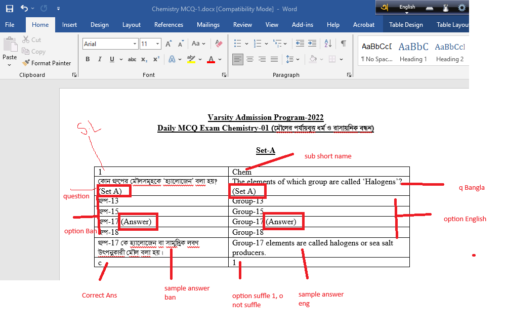

# Question-Generator

A React-based MCQ Question Generator application for creating exam papers with bilingual (Bengali and English) question formats.

## Features

- 📝 Generate Multiple Choice Questions (MCQ) for exams
- 🌐 Bilingual support (Bengali and English)
- 📊 Customizable exam settings (Subject, Total Questions, Set)
- 📋 Structured question format with:
  - Question in both languages
  - Multiple choice options with answer highlighting
  - Explanations in both languages
  - Correct answer indicator
- 🖨️ Print-friendly layout

## Question Format



## Getting Started

### Prerequisites

- Node.js (v16 or higher)
- npm or yarn

### Installation

1. Navigate to the app directory:
   ```bash
   cd question-generator-app
   ```

2. Install dependencies:
   ```bash
   npm install
   ```

3. Start the development server:
   ```bash
   npm run dev
   ```

4. Open your browser and visit `http://localhost:5173`

### Build for Production

```bash
npm run build
```

## Usage

1. Enter the **Exam Title** (e.g., "Varsity Admission Program-2022")
2. Enter the **Subject** (e.g., Chemistry, Physics, Biology, Math)
3. Enter the **Subject Short Name** (e.g., Chem)
4. Enter the **Exam Subtitle** in Bengali (optional)
5. Set the **Total Questions** number
6. Select the **Set** (A, B, C, or D)
7. Click **Generate Questions** to create the question paper

## Tech Stack

- React 19
- Vite
- CSS3

## Project Structure

```
question-generator-app/
├── src/
│   ├── components/
│   │   ├── QuestionForm.jsx      # Input form component
│   │   ├── QuestionForm.css
│   │   ├── QuestionDisplay.jsx   # Question display component
│   │   └── QuestionDisplay.css
│   ├── utils/
│   │   └── questionData.js       # Sample questions data
│   ├── App.jsx                   # Main app component
│   ├── App.css
│   ├── index.css
│   └── main.jsx
├── package.json
└── vite.config.js
```

## License

This project is open source and available under the MIT License.
